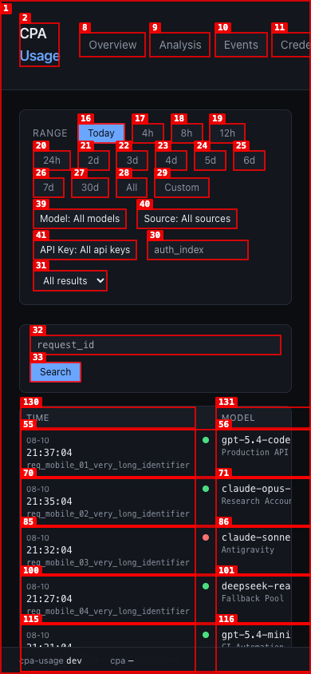
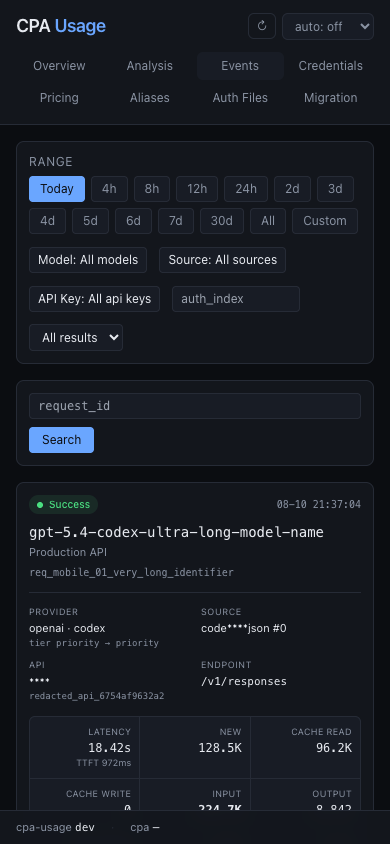

# Dogfood Report: cpa-usage Events mobile layout

| Field | Value |
|---|---|
| **Date** | 2026-08-10 |
| **App URL** | http://127.0.0.1:8318/usage/events |
| **Session** | cpa-usage-mobile-qa |
| **Scope** | Events page at a 390 × 844 mobile viewport |

## Summary

| Severity | Count |
|---|---:|
| Critical | 0 |
| High | 0 |
| Medium | 1 |
| Low | 0 |
| **Total** | **1** |

## Issues

### ISSUE-001: Events table makes the mobile page horizontally overflow

| Field | Value |
|---|---|
| **Severity** | medium |
| **Category** | visual / UX |
| **URL** | http://127.0.0.1:8318/usage/events |
| **Repro Video** | N/A (visible on load) |

**Description**

At a 390 px viewport the document is 961 px wide and the Events table is about 1752 px wide. Only the Time and part of the Model column are visible, so reading one event requires repeated horizontal scrolling. The overflow also distorts the surrounding mobile layout. The expected result is a single-column mobile presentation that keeps the key event fields readable without page-level horizontal scrolling.

**Repro Steps**

1. Open the Events page with populated event data at a 390 × 844 viewport.
2. Observe that the first screen shows only the leading table columns and the page can scroll horizontally.

**Resolution Verification**

- At 320 px and 390 px, both `documentElement.scrollWidth` and `body.scrollWidth` now equal the viewport width.
- At 768 px, Events uses a two-column card layout with no page overflow.
- At 1280 px and 1440 px, the regrouped 9-column table fits its container without an internal horizontal scrollbar.
- All eight app routes were checked at 390 px and had no page-level horizontal overflow.
- The final production build was rechecked at 390 px: viewport, document, and body widths were all exactly 390 px; missing-request-id records remained visible and were no longer exposed as interactive controls.
- The Events page passes the WCAG A/AA axe scan with 0 violations. Axe left four color-contrast nodes for manual review because their translucent/background colors could not be conclusively evaluated.

## CPA usage compatibility verification

The implementation was compared with the latest CLIProxyAPI `origin/main` at `v7.2.128` (`bd34ceca04209ef0460f4b05e3a1a047fb7fad2a`). The `v7.2.128` increment does not change the usage queue or accounting-v2 contract. The final candidate handles the post-`v7.2.72` queue additions:

- canonical accounting v2 (`accounting_version`, `token_breakdown`, accounting quality, non-reasoning and unclassified buckets);
- explicit cache-read presence, `generate`, downstream client metadata, and the OAuth access-token SHA-256 fingerprint;
- canonical `service_tier` with deprecated `request_service_tier` fallback;
- executor-first and exact-provider legacy semantics, without model-name inference;
- the historical repair script follows the same classifier and skips validated accounting-v2 rows;
- multiple provider-call records per `request_id`, plus valid records that omit `request_id`.

The mobile and desktop usage-v2 views were visually checked in the following evidence:

- [390 px viewport](screenshots/mobile-390-usage-v2-viewport-final.png)
- [320 px full page](screenshots/mobile-320-usage-v2-final.png)
- [768 px cards](screenshots/tablet-768-usage-v2-final.png)
- [1280 px table](screenshots/desktop-1280-usage-v2-final.png)
- [390 px event metadata modal](screenshots/mobile-390-modal-usage-v2-final.png)
